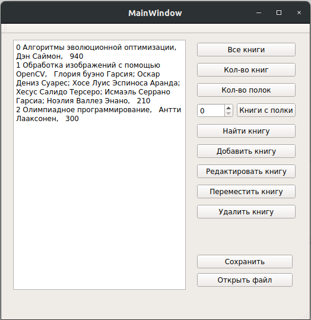

   ## Главное окно

## Диалог открытия файла

## Вывод всех книг в шкафу

## Показать общее количество книг в шкафу

## Количество полок в шкафу

## Вывести книги с полки

## Результаты поиска книги

## Диалоговое окно: Поиск книги.

## Диалоговое окно: Редактирование информации о книге

## Вывод измененной книги:

## Сохранение в файл

 